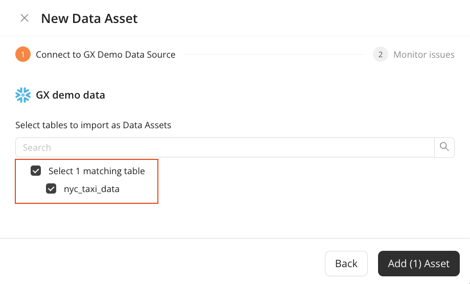
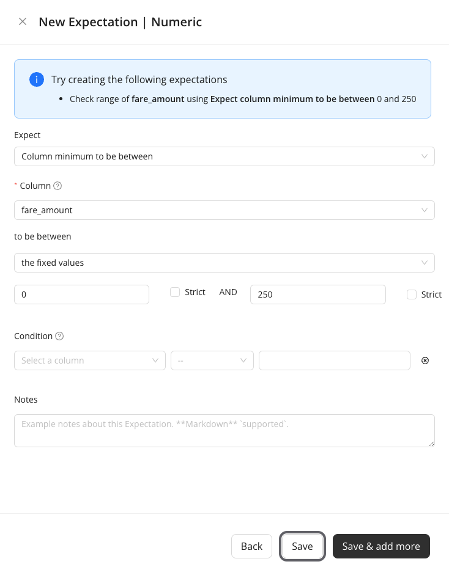
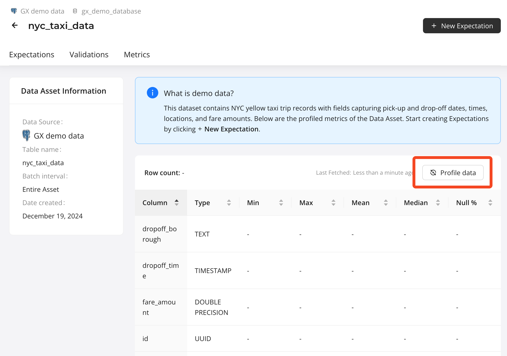
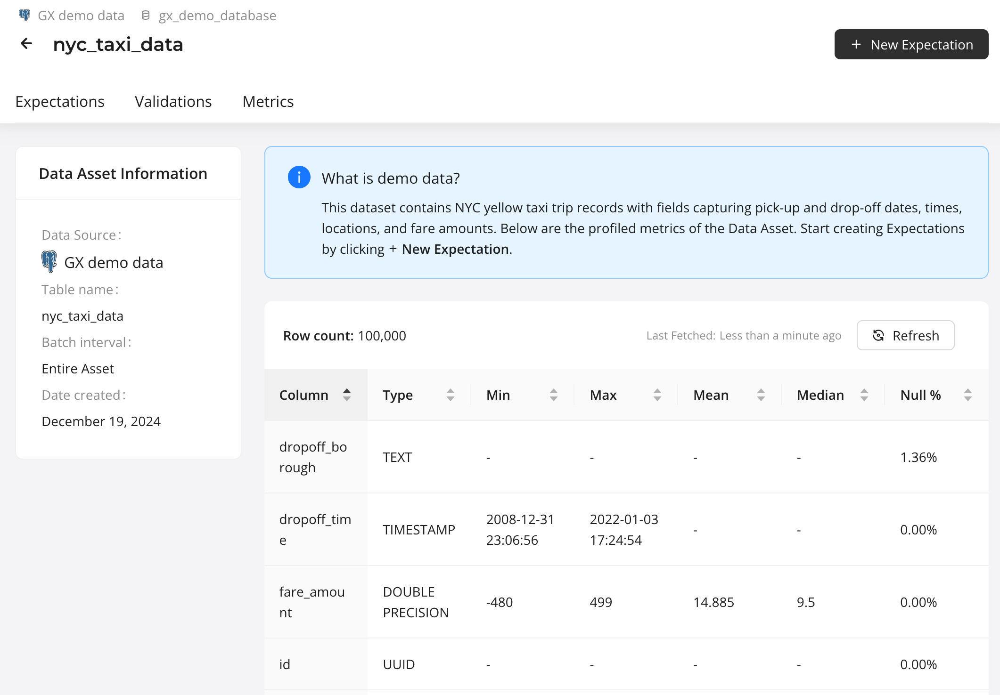
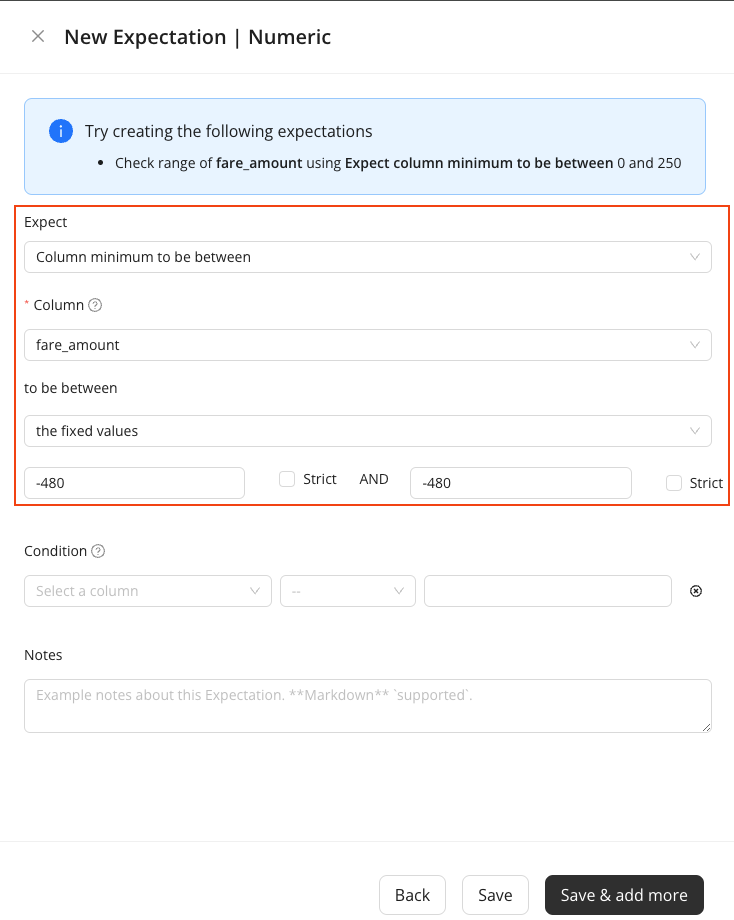
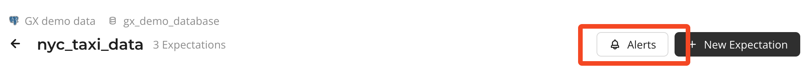

# Get Started with GX Cloud

*This workshop content is current as of 18 December 2024.*

Welcome to our workshop! In this workshop, you'll learn how to connect your GX Cloud account to a sample Data Source, create Expectations, and run Validations.

## Prerequisites
- A [GX Cloud](https://hubl.li/Q02ng2Jx0) account with Admin or Editor permissions.

## Agenda
You'll complete the following tasks in this workshop:

1. [Sign in to GX Cloud](#sign-in-to-gx-cloud)
1. [Use demo data as a Data Source and Data Asset](#use-demo-data)
1. [Create Expectations](#create-expectations)
1. [Validate Expectations](#validate-a-data-asset)
1. [Update the failing Expectation and run the Validation again](#update-the-failing-expectation-and-run-the-validation-again)
1. [Profile Data](#profile-data)
1. [Custom SQL Expectations](#custom-sql-expectations)
1. [Review Validation Schedule](#review-validation-schedule)
1. [Review Alerts](#review-alerts)

## GX terminology
If you're new to GX, an understanding of the following [GX terminology](https://docs.greatexpectations.io/docs/reference/learn/glossary#) will be helpful as you complete this workshop.

 

## Sign in to GX Cloud
Sign in to [GX Cloud](https://hubl.li/Q02ng2Jx0).

## Use Demo Data
You'll need to setup a data source from GX Cloud. We provide demo data for this workshop.

> 1. In GX Cloud under, "Not ready to connect to your data?", click **Use demo data**.

 

> **Select the `nyc_taxi_data` Data Asset**
> 1. On the **Select tables to import** page, check the box next to `nyc_taxi_data`.
> 1. Click **Add 1 Asset**.

 

Congratulations! You have successfully added the `nyc_taxi_data` demo Data Asset to your GX Cloud organization.

## Create Expectations
Expectations are a unique GX construct that enable you to make simple, declarative assertions about your data. You can think of Expectations as unit tests for your data. They make implicit assumptions about your data explicit, and they use self-explanatory language for describing data. Expectations can help you better understand your data and help you improve data quality.

In GX Cloud, you create Expectations for the Data Asset.

The `nyc_taxi_data` Data Asset table contains New York City (NYC) taxi data from January 2022. The [NYC Taxi data](https://www.nyc.gov/site/tlc/about/tlc-trip-record-data.page) is a popular set of open source data that contains records of completed taxi cab trips in NYC, including information such as pick up and drop off times, the number of passengers, the fare collected, and so on.

You'll create Expectations to validate the taxi data. New Expectations are selected from the Expectation picker. The picker can be filtered using the search box or the drop down.

 

Your first Expectation will expect that there is an associated unique `id` for each taxi trip. You expect that you should not see any null `id` values.

> **Create your first Expectation**
> 1. In the **Data Assets** list, click the `nyc_taxi_data` Data Asset.
> 1. Click the **Overview** tab and then **New Expectation**.
>   1. Type `null` into the search box to filter Expectation names
> 1. Click the **Expect column values to not be null** Expectation.
> 1. Create an Expectation that verifies that there is a unique ID for each record:
>
>    1. In the **Column** field, select `id` from the dropdown.
>    1. Click **Save**.

 

 

Once created, your first Expectation is displayed on the Data Asset Expectations page.

Create a second Expectation that checks the passenger count values to determine if the maximum allowable capacity of four passengers is exceeded on any given trip. Typically, trips don't accommodate more than four passengers, since there are normally only four passenger seats in a taxi cab.

> **Create your second Expectation**
>
> Create an Expectation that asserts that there are no more than four passengers for any trip:
>   1. Click back on the **Overview** tab and click on **New Expectation**.
>   1. Click the **Expect column maximum to be between** Expectation.
>   1. In the **Column** field, select `passenger_count` from the dropdown.
>   1. In the first fixed value field, enter `4`.
>   1. In the second fixed value field, enter `4`.
>   1. Leave the other fields blank.
>   1. Click **Save**.

 

Your new `id` and `passenger_count` Expectations appear in the Data Asset **Expectations** list under "Taxi data - Default Expectation Suite".

## Validate a Data Asset
You have successfully created two Expectations. Now, make sure that they pass as expected when you validate your Data Asset.

> **Validate your Data Asset**
>
> On the Data Asset **Expectations** page, click **Validate**.

 

After you click **Validate**, GX Cloud runs queries based on the defined Expectations against the data in Postgres. GX Cloud uses the query results to determine if the data fails or meets your Expectations, and reports the results back to the UI.

After validation is completed, a notification appears indicating that the Validation results are ready. To view the results, you can either click on the link provided in the notification, or click on the Data Asset **Validations** tab.

 

You can see that the `passenger_count` Expectation has failed. This is because some of the larger New York City taxis in NYC are SUVs or minivans that can carry up to seven passengers.

## Update the failing Expectation and run the Validation again
Now that you know the assumption about taxi passenger capacity was incorrect, you need to update the Expectation so the Validation of the `passenger_count` Expectation passes.

> **Update your Expectation**
> 1. Click the **Expectations** tab.
> 1. Click **Edit** (the pencil icon) for the `passenger_count` Expectation.
> 1. In both fixed value fields, change `4` to `7`.
> 1. Click **Save**.

After the Expectation is updated, run the Validation again. When the notification indicating the Validation was successful appears, click the link in the notification or click the **Validations** tab. The `passenger_count` Expectation was successful. You can view the history of your Data Asset Validations by clicking **All Runs** below **Batches & run history**.

 

## Profile Data
You might wonder if there is an easier way to create your Expectations instead of making assumptions or manually inspecting the data. Thankfully, GX Cloud lets you profile data assets directly, so you don't have to wonder!

When you profile a Data Asset, GX Cloud reads the Data Asset and returns a collection of descriptive metrics including column types, statistical summaries, and null percentages.

> **Profile Data for a Data Asset**
> 1. Click the Data Asset **Overview** tab. Basic information about your Data Asset is displayed in the **Data Asset Information** pane.
> 1. Click the **Profile Data** button.

 

When the process completes, an updated view of your Data Asset appears. You can see the Data Asset row count as well as some key information about each of the columns. Take some time now to review the data included in metrics.

 

When you have profiled the data for a Data Asset, you can use the introspection results when creating new Expectations. Let's create a new Expectation for this Data Asset. Note the several subtle, but key, changes on the Expectation creation page.

* When selecting new Expectations types, the **Column** input provides a dropdown menu of existing Data Asset columns, rather than a freeform text field.
* Depending on the Expectation type and column selected, default values are populated automatically.

> **Examine creating a new Expectation using profiled data**
> 1. Click **New Expectation**.
> 1. Click the **Expect column maximum to be between** Expectation.
> 1. In the **Column** menu, select `passenger_count`.
> 1. The value `7` is automatically added to the fixed value fields.
> 1. Click the **X** at the top next to **New Expectation** or click **Back** to cancel.

We've already created this expectation, so go ahead and cancel creating a nw expectation.

 

## Custom SQL Expectations
You can create custom SQL Expectations in GX Cloud. These will fail validation if the SQL query returns one or more rows, so you can perform any query against the data that you wish.

Let's create a new expectation using the custom SQL Expectation form. Since we are using the demo data set and we don't have access to query the data directly, we'll use the example query that is filled in by default.

> **Create Custom SQL Expectation**
> 1. On the Expectations tab, click **New Expectation**
> 1. Click **Create custom Expectation** at the bottom of the panel
> 1. Enter the description, "**Manhattan Passenger Count**"
> 1. Review the SQL query, it should appear as below.
> 1. Click **Save**.

Note that in this query, we're selecting all rows for the "`Manhattan`" `pickup_borough` with a `passenger_count` of `4`.

 

Now that the SQL Expectation is created, run the Validation again. Go to the Validations tab again and see that the Expectation failed. As we saw from the earlier exercise, this is because we will have rides that used taxis with up to 6 seats. When creating this Expectation, we may assume that rides to Manhattan were in smaller cabs because the streets are more crowded, but upon further investigation we know that isn't the case.

 

Edit the Expectation, and in the SQL code box, change `passenger_count > 4` to `passenger_count > 6`. Rerun the Validation again and view the results.

 

Congratulations! You've created a custom SQL Expectation.

## Review Validation Schedule
GX Cloud will create a validation schedule when expectations are created. The schedule can be paused by clicking the "On" radio button to "Off". The schedule can also be modified by clicking the pencil "Edit Schedule" button.

 

The default schedule is to run every 24 hours, starting at the top of the next hour. Edit the validation schedule now.

> **Edit the Validation schedule**
> 1. Click **Edit Schedule** (the pencil icon).
> 1. Click **Frequency** drop down.
> 1. Select **Every 6 hours**.
> 1. Click **Save**.

 

## Review Alerts
GX Cloud will automatically send alerts to users' email address. To disable or re-enable this, open the Alerts panel. This is controlled on a per-user basis, so other users within your organization will need to enable this if they would like to be alerted to failing validations.

> **Review Alerts**
> 1. Click the **Alerts** button.
> 1. Click the radio button to turn off Email alerts, click it again to turn on Email alerts.

 

 

## Conclusion
Congratulations! You've successfully completed th Get Started with GX Cloud Workshop. You have connected the demo Data Source and Data Asset, created Expectations, run some Validations, and fetched Metrics for the data. We hope you have a better understanding of how GX Cloud works and how it can work within your data pipeline.

## What's next?
* [Connect to your own Data Source](https://docs.greatexpectations.io/docs/cloud/connect/connect_lp)
* [Create your own Expectations in GX Cloud](https://docs.greatexpectations.io/docs/cloud/expectations/manage_expectations)
* Use the [GX Python API](https://docs.greatexpectations.io/docs/oss/) to create Data Sources, Data Assets, and Expectations
* Connect to GX Cloud from an orchestrator (for example, [Airflow](https://airflow.apache.org/))
* [Invite others](https://docs.greatexpectations.io/docs/cloud/users/manage_users#invite-a-user) to work in your GX Cloud organization
* Explore our [documentation](https://docs.greatexpectations.io/docs/cloud/)
