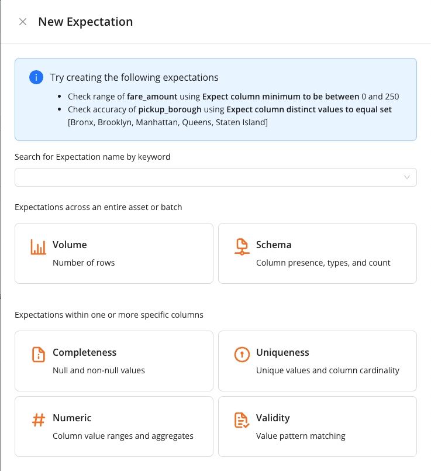
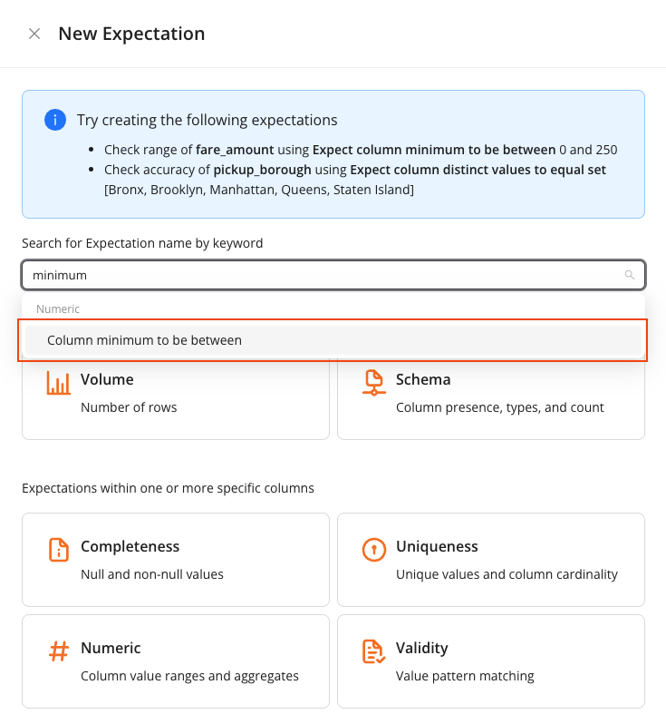
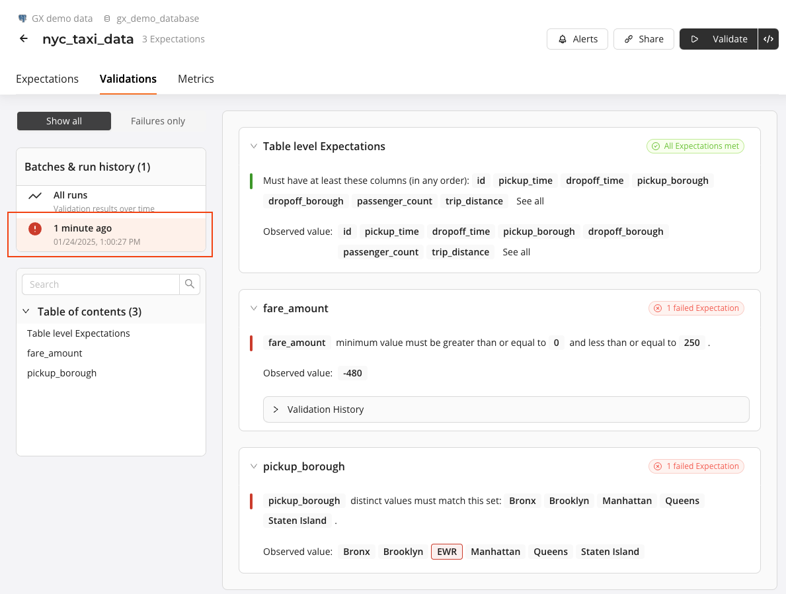
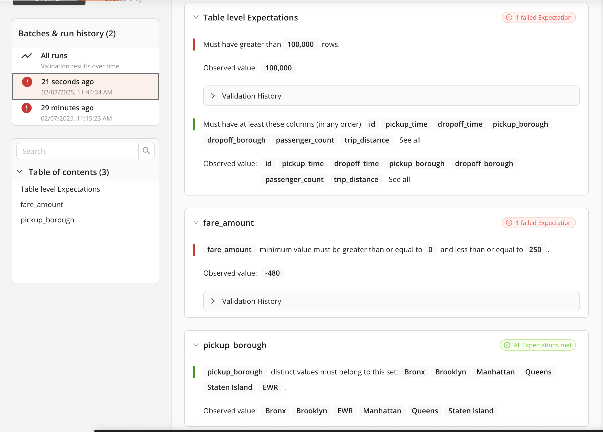
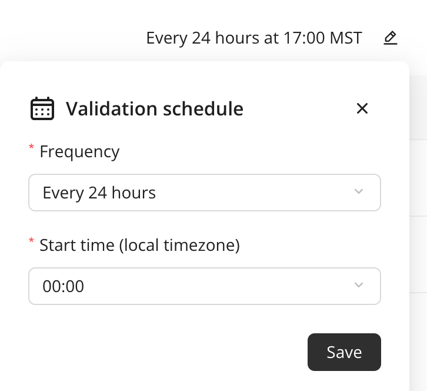
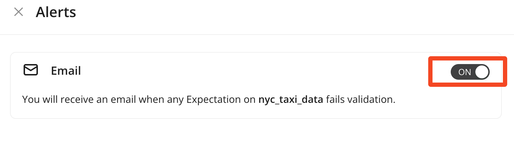
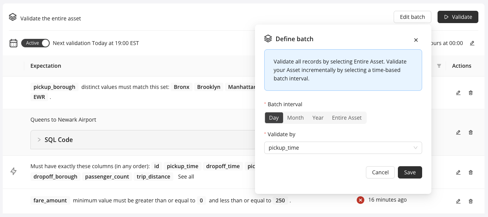

# Get Started with GX Cloud

*This workshop content is current as of 10 February 2025.*

Welcome to our workshop! In this workshop, you'll learn how to connect your GX Cloud account to a sample Data Source, create Expectations, and run Validations.

## Prerequisites
- A [GX Cloud](https://hubl.li/Q02ng2Jx0) account with Admin or Editor permissions.

## Agenda
You'll complete the following tasks in this workshop:

1. [Sign in to GX Cloud](#sign-in-to-gx-cloud)
1. [Use demo data as a Data Source and Data Asset](#use-demo-data)
1. [Create Expectations](#create-expectations)
1. [Validate Expectations](#validate-a-data-asset)
1. [Update the failing Expectation and run the Validation again](#update-the-failing-expectation-and-run-the-validation-again)
1. [Profile Data](#profile-data)
1. [Custom SQL Expectations](#custom-sql-expectations)
1. [Review Validation Schedule](#review-validation-schedule)
1. [Review Alerts](#review-alerts)

## GX terminology
If you're new to GX, an understanding of the following [GX terminology](https://docs.greatexpectations.io/docs/reference/learn/glossary#) will be helpful as you complete this workshop.

<br>

## Sign in to GX Cloud
Sign in to [GX Cloud](https://hubl.li/Q02ng2Jx0).

## Use Demo Data
You'll need to setup a data source from GX Cloud. We provide demo data in a PostgreSQL database for this workshop.

> 1. In GX Cloud under, "Not ready to connect to your data?", click **Use demo data**.

<br>

> **Select the `nyc_taxi_data` Data Asset**
> 1. On the **Select tables to import** page, check the box next to `nyc_taxi_data`.
> 1. Click **Add 1 Asset**.
> 1. Click **Start monitoring**.

<br>
<br>

Congratulations! You have successfully added the `nyc_taxi_data` demo Data Asset to your GX Cloud organization. Click onto the newly-created Data Asset to view it.

<br>

## Generate Expectations
GX Cloud helps you get started on your data quality journey by leveraging AI to analyze your data and generate Expectations for you. This is especially helpful if you're just getting started and are unsure of where to start with your data quality checks. 

> 1. Click on the **Generate Expecations** button.

<br>

GX Cloud will work in the background to generate Expectations, leveraging the power of AI. The generated Expectations may be different each time you use the tool. To see other iterations, simply delete the Expectations that were created and click on the **Generate Expectations** button to try again.

<br>


## Manually Create Expectations
Expectations are a unique GX construct that enable you to make simple, declarative assertions about your data. You can think of Expectations as unit tests for your data. They make implicit assumptions about your data explicit, and they use self-explanatory language for describing data. Expectations can help you better understand your data and help you improve data quality.

In GX Cloud, you create Expectations for the Data Asset.

The `nyc_taxi_data` Data Asset table contains New York City (NYC) taxi data from January 2022. The [NYC Taxi data](https://www.nyc.gov/site/tlc/about/tlc-trip-record-data.page) is a popular set of open source data that contains records of completed taxi cab trips in NYC, including information such as pick up and drop off times, the number of passengers, the fare collected, and so on.

By default, GX Cloud creates an Expectation to detect schema changes and an Expectation to ensure volume changes. Notice that once you've clicked into the newly-created Data Asset, there are Expectations already created in the Expectations list. Take a moment to review these Expectations.

You can also create additional Expectations to validate the taxi data. New Expectations can be created by clicking on the `+ New Expectation` button in the upper righthand corner of the screen. 

<br>

GX Cloud has suggested a few Expectations to create in the information box at the top of the modal. 

> **Create your first Expectation**
> 1. Type `minimum` into the search box to filter Expectation names.
> 1. Click the **Column minimum to be between** option.
> 1. Create an Expectation that verifies that the minimum range of the `fare_amount` column is between 0 and 250
>
>    1. In the **Column** field, select `fare_amount`.
>    1. Enter `0` and `250` into the two fields below `the fixed values`.
>    1. Click **Save**.

<br>

<br>

Once created, the new Expectation will appear at the bottom of the Expectations list.

Create a second Expectation that checks the accuracy of the `pickup_borough` column. 

> **Create your second Expectation**
>
> Create an Expectation that asserts that there are no more than four passengers for any trip:
> 1. Click back on **+ New Expectation**.
> 1. Type `distinct` into the search box to filter Expectation names.
> 1. Click the **Column distinct values to be in set** option. 
>   1. In the **Column** field, select `pickup_borough`.
>   1. Under **Value Set**, enter separate entries for `Bronx`, `Brooklyn`, `Manhattan`, `Queens`, and `Staten Island`.
>   1. Click **Save**.

<br>

The second Expectation you created appears at the bottom of the Expectation list.

## Validate a Data Asset
You have successfully created two Expectations. Now, make sure that they pass as expected when you validate your Data Asset.

> **Validate your Data Asset**
>
> On the Data Asset **Expectations** page, click **Validate**.

<br>

After you click **Validate**, GX Cloud runs queries based on the defined Expectations against the data in Postgres. GX Cloud uses the query results to determine if the data fails or meets your Expectations, and reports the results back to the UI.

After validation is completed, a notification appears indicating that the Validation results are ready. To view the results click on the Data Asset **Validations** tab.

You can see that while automatically-generated Expectations have passed, the two Expectations that you manually added have both failed. You can investigate why they've failed by clicking on the **Validations** tab and then clicking on the most recent validation run on the lefthand side.

<br>

## Update the failing Expectations and run the Validation again
The `fare_amount` Expectation is failing because GX Cloud detected that there is at least one row that falls outside of our expected range. Specifically, one of the rows in our demo data contains a fare amount of `-480`. It may be that refunds for rides are entered in as negative numbers, or there may simply be an issue with the data itself. In a real world scenario, you will want to start an investigation and then decide next steps therafter.

The `pickup_borough` Expectation is failing because there are some rows that have a value of `EWR` in this column. Since that is an acceptable value and we simply missed it when setting up the Expectation, it will need to be updated to include it.

> **Update your Expectation**
> 1. Click the **Expectations** tab.
> 1. Click **Edit** (the pencil icon) for the `pickup_borough` Expectation.
> 1. Add an additional value for `EWR` in the **Value Set**.
> 1. Click **Save**.

After the Expectation is updated, click the **Validate** button again. When the notification indicating the Validation was successful appears, click the **Validations** tab. The `pickup_borough` Expectation has now passed, while the `fare_amount` Expectation has failed, since we did not update it. You will also see that the volume Expectation that was automatically generated has failed as well. That is because the number of rows of data has not increased.

<br>

## Profile Data
You might wonder if there is an easier way to create your Expectations instead of making assumptions or manually inspecting the data. Thankfully, GX Cloud lets you profile data assets directly, so you don't have to wonder!

When you profile a Data Asset, GX Cloud reads the Data Asset and returns a collection of descriptive metrics including column types, statistical summaries, and null percentages.

> **Profile Data for a Data Asset**
> 1. Click the Data Asset **Metrics** tab. The first time you visit this tab, it will fetch basic information about your Data Asset and display it in the **Data Asset Information** pane, as well as fetch the schema and display it in the table. 
> 1. Click the **Profile Data** button.

<br>

When the process completes, an updated view of your Data Asset appears. You can see the Data Asset row count as well as some key information about each of the columns. Take some time now to review the data included in metrics.

<br>

Once you have profiled the data for a Data Asset, you can use the introspected results when creating new Expectations. Let's create a new Expectation for this Data Asset. Note the subtle, but key, changes on the Expectation creation page.

* Depending on the Expectation type and column selected, default values are populated automatically.

> **Examine creating a new Expectation using profiled data**
> 1. Type `minimum` into the search box to filter Expectation names.
> 1. Click the **Column minimum to be between** option.
> 1. In the **Column** menu, select `fare_amount`.
> 1. The value `-480` is automatically added to the fixed value fields.
> 1. Click the **X** at the top next to **New Expectation** or click **Back** to cancel.

You've already created this expectation, so go ahead and cancel creating a new expectation.

<br>

## Custom SQL Expectations
You can also create custom SQL Expectations in GX Cloud. These will fail validation if the SQL query returns one or more rows. You can perform any query against the data that you wish.

Let's create a new expectation using the custom SQL Expectation form. We're going to modify the example query that is filled in by default. 

> **Create Custom SQL Expectation**
> 1. Click on the **Expectations** tab.
> 1. Click **+ New Expectation**.
> 1. Click the **SQL** at the bottom of the panel.
> 1. Enter the description, "**Queens to Newark Airport**".
> 1. Delete the comment in the first line.
> 1. Modify the `WHERE` clause in the query to look like this:
```sql
SELECT
  *
FROM
  {batch}
WHERE
  pickup_borough = 'Queens'
  AND dropoff_borough = 'EWR'
  AND fare_amount < 75
```
> Click **Save**.

In this query, we're selecting all rides from `Queens` to the Newark Airport (code `EWR`), where the fares are less than `100` ($100 US). We know that Queens to EWR is generally a long drive, so we expect it to be expensive.

<br>

Now that the SQL Expectation is created click **Validate**. Go to the **Validations** tab, and see that the Custom Sql Expectation has passed.

<br>

Congratulations! You've created a custom SQL Expectation.

## Review Validation Schedule
GX Cloud will create a validation schedule when expectations are created. The schedule can be paused by clicking the "On" radio button to "Off". The schedule can also be modified by clicking the pencil "Edit Schedule" button.

<br>

The default schedule is to run every 24 hours, starting at the top of the next hour. Edit the validation schedule now.

> **Edit the Validation schedule**
> 1. Click **Edit Schedule** (the pencil icon).
> 1. Click **Frequency** drop down.
> 1. Select **Every 6 hours**.
> 1. Click **Save**.

<br>

## Review Alerts
GX Cloud will automatically send alerts to users' email address. To disable or re-enable this, open the Alerts panel. This is controlled on a per-user basis, so other users within your organization will need to enable this if they would like to be alerted to failing validations.

> **Review Alerts**
> 1. Click the **Alerts** button.
> 1. Click the radio button to turn off Email alerts, click it again to turn on Email alerts.

<br>

<br>

## Using Batches of Data
By default, GX Cloud validates the entire set of data in your Data Asset. However, users will often want to run validations regularly as data is ingested. GX Cloud allows you to validate a subset of the data, using a date column within your data set, and then choosing whether to divide the data on day, month of year.

> **Edit the batch of data**
> 1. Click on the **Expectations** tab.
> 1. Click on **Edit batch**, which can be found beside the **Validate** button.
> 1. Click on **Day**.
> 1. In the **Validate by** dropdown, select `pickup_time`.

<br>

Clicking on the **Validate** button now gives you a new window where you can select the specific batch of data you would like to validate. You can either select the **Latest Batch**, which will choose the latest batch currently available in the data set, or choose a specific day by selecting **Custom Batch**. For now, leave **Latest Batch** selected and click on the **Run** button.

When the Validation is complete, you will see that the results of the latest run are slightly different. The `fare_amount` Expectation is now passing, since the lowest fare collected 

<br>

## Conclusion
Congratulations! You've successfully completed th Get Started with GX Cloud Workshop. You have connected the demo Data Source and Data Asset, created Expectations, run some Validations, and fetched Metrics for the data. We hope you have a better understanding of how GX Cloud works and how it can work within your data pipeline.

## What's next?
* [Connect to your own Data Source](https://docs.greatexpectations.io/docs/cloud/connect/connect_lp)
* [Create your own Expectations in GX Cloud](https://docs.greatexpectations.io/docs/cloud/expectations/manage_expectations)
* Use the [GX Python API](https://docs.greatexpectations.io/docs/oss/) to create Data Sources, Data Assets, and Expectations
* Connect to GX Cloud from an orchestrator (for example, [Airflow](https://airflow.apache.org/))
* [Invite others](https://docs.greatexpectations.io/docs/cloud/users/manage_users#invite-a-user) to work in your GX Cloud organization
* Explore our [documentation](https://docs.greatexpectations.io/docs/cloud/)
