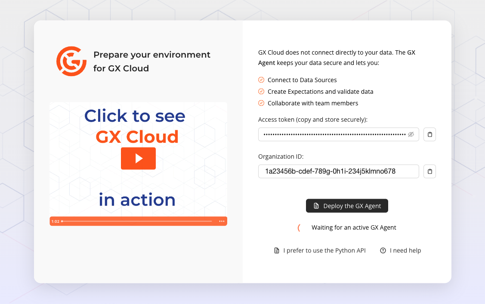
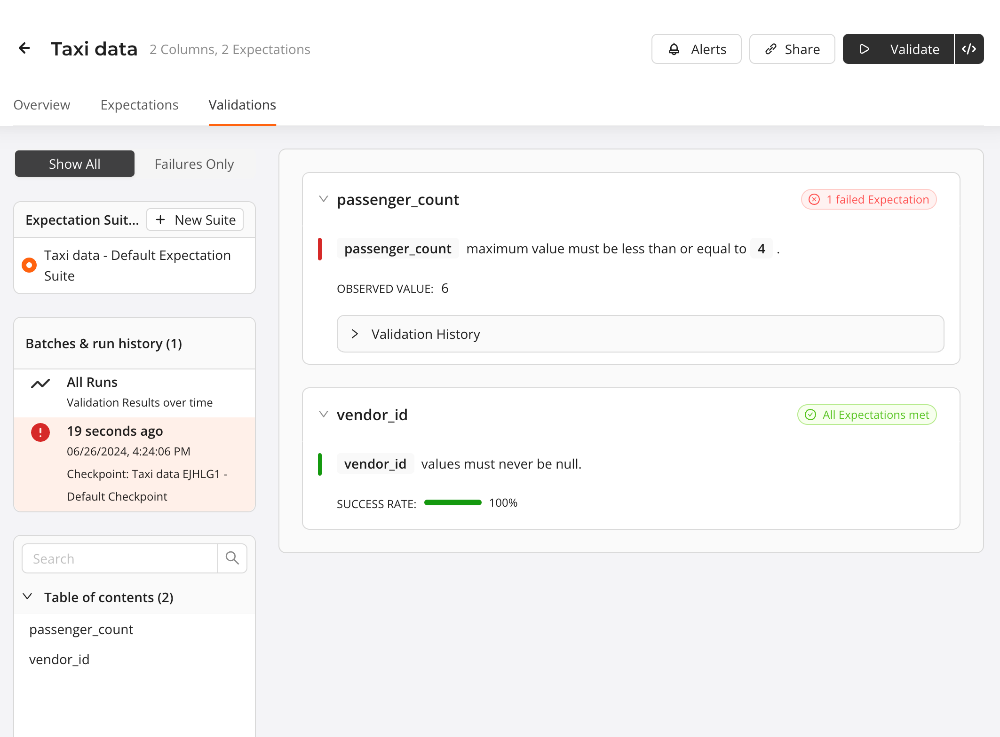
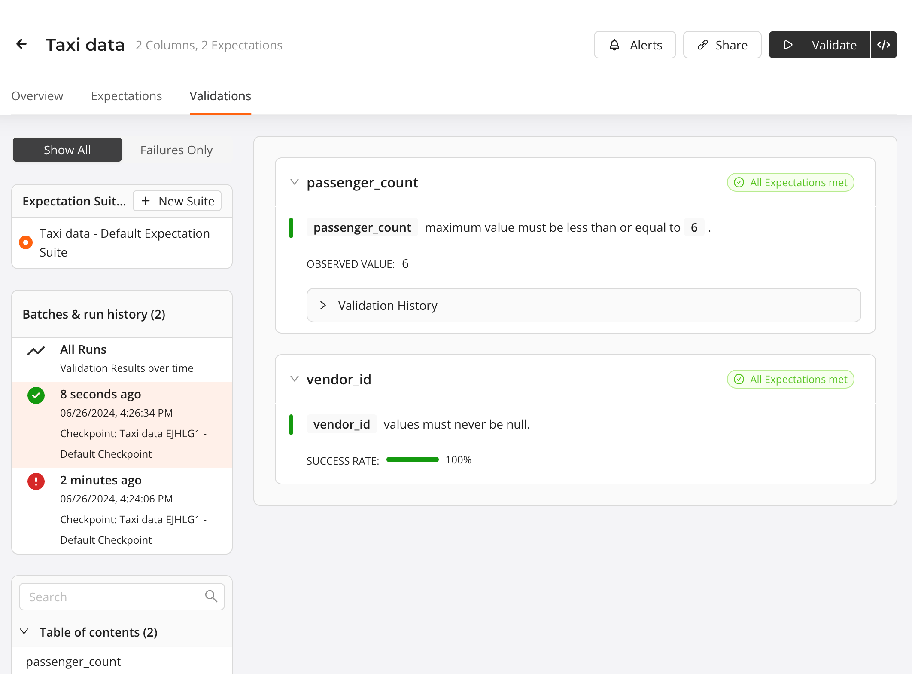

# Get Started with GX Cloud and Snowflake

*This workshop content is current as of 21 February 2024.*

Welcome to our workshop! In this workshop, you'll learn how to connect your GX Cloud account to a Snowflake Data Source, create Expectations, and run Validations.

## Prerequisites
- A [GX Cloud](https://hubs.li/Q02mpbXd0) account with Admin or Editor permissions.
- [Docker Desktop](https://docs.docker.com/get-docker/) installed and running on the computer you're using for the workshop.
- Credentials for the shared [GX Workshop Snowflake instance](https://vntumnu-gx_workshops.snowflakecomputing.com/). [Contact us](mailto:support@greatexpectations.io) if you need credentials.

## Agenda
You'll complete the following tasks in this workshop:

1. [Sign in to GX Cloud](#sign-in-to-gx-cloud)
2. [Run the GX Agent](#run-the-gx-agent)
3. [Create a Snowflake Data Source and Data Asset](#create-a-snowflake-data-source-and-data-asset)
4. [Create Expectations](#create-expectations)
5. [Validate Expectations](#validate-a-data-asset)
6. [Update the failing Expectation and run the Validation again](#update-the-failing-expectation-and-run-the-validation-again)
7. [Fetch Metrics](#fetch-metrics)

## GX terminology
If you're new to GX, an understanding of the following GX terminology will be helpful as you complete this workshop.

<br>

## Sign in to GX Cloud
Sign in to [GX Cloud](https://hubs.li/Q02mpbXd0).

## Run the GX Agent
The GX Agent is an intermediary between GX Cloud and your data stores. GX Cloud does not connect directly to your data; all data access occurs within the GX Agent. The GX Agent receives jobs from GX Cloud, executes these jobs against your data, and then sends the job results back to GX Cloud. The GX Agent runs in an environment where it has access to your data. Today, you'll run it on your local machine using Docker.

To learn more about the GX Agent and how it works with GX Cloud, [see our GX Cloud architecture documentation](https://docs.greatexpectations.io/docs/cloud/about_gx#gx-cloud-architecture).

### Get your user access token and organization identifier
To allow the GX Agent to connect to your GX Cloud organization, you need to supply a user access token and organization identifier.

If you are logging into GX Cloud for the first time, you will be presented with the following screen:
<br>
> 1. Copy the value in the **Access token** field and store it in a safe location - you'll need it shortly!
> 1. Copy the value in the **Organization ID** field and store it with the user access token. 

### Start the GX Agent
You use Docker to start and run the GX Agent.

> **Start the GX Agent**
> 1. Copy and paste the following command into a terminal:
>  ```bash
> docker run --rm --pull=always -e GX_CLOUD_ACCESS_TOKEN="<user_access_token>"
> -e GX_CLOUD_ORGANIZATION_ID="<organization_id>" greatexpectations/agent
> ```
> 2. Replace `<user_access_token>` with your user access token and `<organization_id>` with the organization identifier that you copied.
> 3. Run the command.

Before starting the GX Agent, Docker will download the latest GX Agent image. This might take a few minutes. When it is done, your terminal displays `The GX Agent is ready.`

<br>


## Create a Snowflake Data Source and Data Asset
With the GX Agent running, you can connect to Snowflake from GX Cloud (via the GX Agent).

> **Create a Snowflake Data Source**
> 1. In GX Cloud, click **Data Assets** > **New Data Asset**.
> 1. Click **Snowflake**.
> 1. Click on the **I have created a GX Cloud user with access permissions** checkbox and click on **Continue**
> 1. Configure the Snowflake Data Source connection:
>
>    * In the **Data Source name** field, enter a name. For example, `GX Workshop Snowflake`.
>    * In **Username** field, enter the Snowflake username that you use to log in to the [GX Workshop Snowflake instance](https://vntumnu-gx_workshops.snowflakecomputing.com/).
>    * In **Account identifier** field, enter `VNTUMNU-GX_WORKSHOPS`.
>    * In **Password** field, enter the Snowflake password that you use to log in to the [GX Workshop Snowflake instance](https://vntumnu-gx_workshops.snowflakecomputing.com/).
>    * In the **Database** field, enter `GXWORKSHOP`.
>    * In the **Schema** field, enter `PUBLIC`.
>    * In the **Warehouse** field, enter `COMPUTE_WH`.
>    * In the **Role** field, enter `PUBLIC`.
>    * Select **Test connection** to test the Data Source connection upon creation.
> 1. Click **Continue**.

<br>

> **Configure the Snowflake Data Asset**
> 1. Select **Table Asset**.
> 1. In the **Table Name** field, enter `TAXI_DATA`.
> 1. In the **Data Asset name** field, give your data Asset a name. For example, `Taxi data`.
> 1. Click **Finish**.

Congratulations! You have successfully added a Snowflake Data Asset to your GX Cloud organization.

## Create Expectations
Expectations are a unique GX construct that enable you to make simple, declarative assertions about your data. You can think of Expectations as unit tests for your data. They make implicit assumptions about your data explicit, and they use self-explanatory language for describing data. Expectations can help you better understand your data and help you improve data quality.

In GX Cloud, you create Expectations within an Expectation Suite, which is just a collection of Expectations.

The Snowflake Data Asset table contains New York City (NYC) taxi data from January 2019. The [NYC Taxi data](https://www.nyc.gov/site/tlc/about/tlc-trip-record-data.page) is a popular set of open source data that contains records of completed taxi cab trips in NYC, including information such as pick up and drop off times, the number of passengers, the fare collected, and so on.

You'll create Expectations to validate the taxi data. You will create a new Expectation Suite as a part of creating your first Expectation.

Your first Expectation will expect that there is an associated vendor for each taxi trip. You expect that you should not see any null `vendor_id` values.

> **Create your first Expectation**
> 1. In the **Data Assets** list, click the `Taxi data` Data Asset.
> 1. Click the **Overview** tab and then **New Expectation**.
> 1. Click the **New Suite** tab.
> 1. In the **Enter new Expectation Suite name** field, enter a name for the Expectation suite. For example, `GX Workshop Suite`.
> 1. Create an Expectation that verifies that there is an associated vendor for each taxi trip:
>
>    1. Select `expect_column_values_to_not_be_null` below **Missingness**.
>    1. In the **Column** field, select `vendor_id`.
>    1. Click **Save**.

<br>

Once created, your first Expectation is displayed on the Data Asset Expectations page.

Create a second Expectation that checks the passenger count values to determine if the maximum allowable capacity of four passengers is exceeded on any given trip. Typically, trips don't accommodate more than four passengers, since there are normally only four passenger seats in a taxi vehicle.

> **Create your second Expectation**
>
> Create an Expectation that asserts that there are no more than four passengers for any trip:
>   1. Click back on the Overview tab and then New Expectation
>   1. Click on Existing Suite and select the name of the suite you created in the previous step.
>   1. Select `expect_column_max_to_be_between` below **Values and Statistics**.
>   1. In the **Column** field, select `passenger_count`.
>   1. In the **Max Value** field, enter `4`.
>   1. Leave the other fields blank.
>   1. Click **Save**.

<br>


Your new `vendor_id` and `passenger_count` Expectations appear in the Data Asset **Expectations** list under the `GX Workshop Suite` Expectation Suite.

## Validate a Data Asset
You have successfully created two Expectations. Now, make sure that they pass as expected when you validate  your Data Asset.

> **Validate your Data Asset**
>
> On the Data Asset **Expectations** page, click **Validate**.

<br>

After you click **Validate**, GX Cloud sends a job to your locally running GX Agent to run queries, based on the defined Expectations, against the data in Snowflake. The GX Agent uses the query results to determine if the data fails or meets your Expectations, and reports the results back to GX Cloud.

After validation is completed, a notification appears indicating that the Validation results are ready. To view the results, you can either click on the link provided in the notification, or click on the Data Asset **Validations** tab.

<br>

You can see that the `passenger_count` Expectation has failed. This is because some of the larger New York City taxis in NYC can carry up to six passengers.

## Update the failing Expectation and run the Validation again
Now that you know your assumption about taxi passenger capacity was incorrect, you need to update the Expectation so the Validation of the `passenger_count` Expectation passes.

> **Update your Expectation**
> 1. Click the **Expectations** tab.
> 1. Click **Edit** (the pencil icon) for the `passenger_count` Expectation.
> 1. In the **Max Value** field, delete `4` and enter `6`.
> 1. Click **Save**.

After the Expectation is updated, run the Validation again. When the notification indicating the Validation was successful appears, click the link in the notification or click the **Validations** tab. The `passenger_count` Expectation was successful. You can view the history of your Data Asset Validations by clicking **All Runs** below **Batches & run history**.

<br>

## Fetch Metrics
You might wonder if there is an easier way to create your Expectations, instead of making assumptions or manually inspecting the data. Thankfully, GX Cloud lets you fetch the metrics from your data directly, so that you don't have to!

When you fetch Metrics for a Data Asset, GX Cloud profiles your Data Asset (using the GX Agent) and returns a collection of descriptive metrics including column types, statistical summaries, and null percentages.

> **Fetch Metrics for a Data Asset**
> 1. Click the Data Asset **Overview** tab. Basic information about your Data Asset is displayed in the **Data Asset Information** pane.
> 1. Click the **Profile Data** button. 

When the process completes, an updated view of your Data Asset appears. You can see the Data Asset row count as well as some key information about each of the columns. Take some time now to review the data included in Metrics.

<br>

When you have fetched Metrics for a Data Asset, you can use the introspection results when creating new Expectations. Let's create a new Expectation for this Data Asset. Note the several subtle, but key, changes on the Expectation creation page.

* When selecting new Expectations types, the **Column** input provides a dropdown menu of existing Data Asset columns, rather than a freeform text field.

* Depending on the Expectation type and column selected, default values are populated automatically.

> **Examine creating a new Expectation using Metrics data**
> 1. Click **New Expectation**.
> 1. Select `expect_column_max_to_be_between` below **Values and Statistics**.
> 1. In the **Column** menu, select `passenger_count`.
> 1. The value `6` is automatically added to the **Min Value** and **Max Value** fields.

<br>


## Conclusion
Congratulations! You've successfully completed the GX Cloud Snowflake Workshop. You have created a Snowflake Data Source and Data Asset, created Expectations, run some Validations, and fetched Metrics for your data. We hope you have a better understanding of how GX Cloud works and how it can work within your data pipeline.

## What's next?
* [Connect to your own Snowflake instance](https://docs.greatexpectations.io/docs/cloud/connect/connect_snowflake)
* [Create your own Expectations in GX Cloud](https://docs.greatexpectations.io/docs/cloud/expectations/manage_expectations)
* Use the [GX Python API](https://docs.greatexpectations.io/docs/oss/) to create Data Sources, Data Assets, Expectations, Expectation Suites, and Checkpoints
* Connect to GX Cloud from an orchestrator (for example, [Airflow](https://airflow.apache.org/))
* [Invite others](https://docs.greatexpectations.io/docs/cloud/users/manage_users#invite-a-user) to work in your GX Cloud organization
* Explore our [documentation](https://docs.greatexpectations.io/docs/cloud/)