# Getting Started with GX Cloud and Snowflake

This workshop content is current as of 21 February 2024.

## Introduction
Welcome to our *Getting Started with GX Cloud and Snowflake* workshop! In this workshop, you will learn how to connect your GX Cloud account to a Snowflake Data Source, create Expectations, and run Validations.

## Prerequisites
In order to successfully run this workshop, you need to have the following:
- Your own [GX Cloud](https://app.greatexpectations.io/login?ssac=true) account
- [Docker Desktop](https://docs.docker.com/get-docker/) installed and running on your local machine.
- Credentials for our shared [GX Workshop Snowflake instance](https://vntumnu-gx_workshops.snowflakecomputing.com/). Please [reach out to us](mailto:support@greatexpectations.io) if you do not have an account!

## Agenda
This workshop walks you through the following hands-on activities:

1. [Log in to GX Cloud](#step-1---log-in-to-gx-cloud)
2. [Run the GX Agent](#step-2---run-the-gx-agent)
3. [Create a Snowflake Data Source and Data Asset](##step-3---create-a-snowflake-data-source-and-data-asset)
4. [Create Expectations](#step-4---create-expectations)
5. [Validate Expectations](#step-5---validate-a-data-asset)
6. [Update failing Expectations and re-run Validations](#step-6---update-failing-expectations-and-re-run-validations)
7. [Fetch Metrics](#step-7---fetch-metrics)

## Basic GX components
If you are new to GX, you'll find the following terminology helpful as you undertake this workshop.

| GX Component | What is it? |
| :- | :- |
| Data Source | The GX representation of a data store. For this workshop, the Data Source is the Snowflake schema containing our data. |
| Data Asset | A collection of records within a Data Source. For this workshop, the Data Asset is the Snowflake table containing our data. |
| Expectation | A verifiable assertion about data. |
| Expectation Suite | A collection of Expectations. |
| Checkpoint | A data validation mechanism that runs an Expectation Suite on a Data Asset. |

## Workshop Exercises

### Step 1 - Log in to GX Cloud
Start by logging into [GX Cloud](https://app.greatexpectations.io/login).

### Step 2 - Run the GX Agent
GX Cloud does not connect directly to your data. Instead, it uses the **GX Agent** as an intermediary between GX Cloud and your data stores. The GX Agent runs in an environment where it has access to your data - today, you'll run it on your local machine using Docker. The GX Agent receives jobs from GX Cloud, executes these jobs against your data, and then sends the job results back to GX Cloud.

If you are interested in learning more about the GX Agent and how it fits into the GX Cloud architecture, [check out our docs](https://docs.greatexpectations.io/docs/cloud/about_gx#gx-cloud-architecture).

#### Get your user access token and organization id
To allow the GX Agent to connect to your GX Cloud organization, you need to supply a **user access token** and **organization id**.

> **Create a user access token**
> * In the GX Cloud UI, click **Settings** > **Tokens** in the sidebar to navigate to the Tokens page.
> * Click the **Create user access token** button.
> * Provide a name for your token and click **Create**.
> * Copy your new token value and store it in a safe place - you'll need it shortly!
>
>   *You are only shown the value of your new token once. If you lose the value, you will need to create a new user access token by repeating the same steps.*

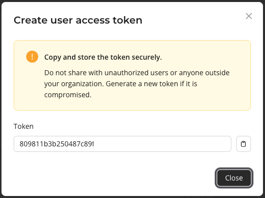<br>

> **Get your organization id**
> * Click **Settings** > **Tokens** in the sidebar to navigate to the Tokens page.
> * Copy your Organization ID.

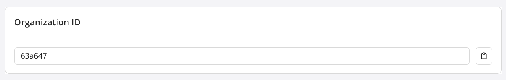<br>

#### Start the GX Agent
You will use Docker to start and run the GX Agent. The following command is the template command for starting the GX Agent:

```bash
docker run --rm --pull=always -e GX_CLOUD_ACCESS_TOKEN="<user_access_token>" -e GX_CLOUD_ORGANIZATION_ID="<organization_id>" greatexpectations/agent
```

> **Start the GX Agent**
> * Using the template Docker command:
>   * Replace `<user_access_token>` with your user access token value.
>   * Replace `<organization_id>` with your organization id.
> * Execute the edited command in your local terminal.

Before starting the agent, Docker will download the latest GX Agent image. This may take a few minutes. Once the GX Agent is running, `The GX Agent is ready.` will be displayed in your terminal output.

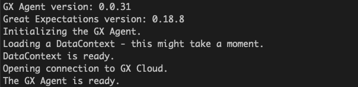<br>


## Step 3 - Create a Snowflake Data Source and Data Asset
With the GX Agent running, we can now connect to Snowflake from the GX Cloud UI (via the GX Agent).

> **Create a Snowflake Data Source**
> * In the GX Cloud UI, click **Data Assets** in the sidebar to navigate to the Data Assets page.
> * Click the **New Data Asset** button.
> * Click the **Snowflake** button to create a new Snowflake Data Source.
> * On the Add a Data Asset page, you'll populate the connection details required for your new Data Source.
>
>   * In the **Data Source name** field, enter a name. For example, `GX Workshop Snowflake`.
>   * In **Username** field, enter the Snowflake username that you use to log in to the [GX Workshop Snowflake instance](https://vntumnu-gx_workshops.snowflakecomputing.com/).
>   * In **Account identifier** field, enter `VNTUMNU-GX_WORKSHOPS`.
>   * In **Password** field, enter the Snowflake password that you use to log in to the [GX Workshop Snowflake instance](https://vntumnu-gx_workshops.snowflakecomputing.com/).
>   * In the **Database** field, enter `GXWORKSHOP`.
>   * In the **Schema** field, enter `PUBLIC`.
>   * In the **Warehouse** field, enter `COMPUTE_WH`.
>   * In the **Role** field, enter `PUBLIC`.
> * Check the **Test connection** checkbox.
> * Click the **Continue** button.

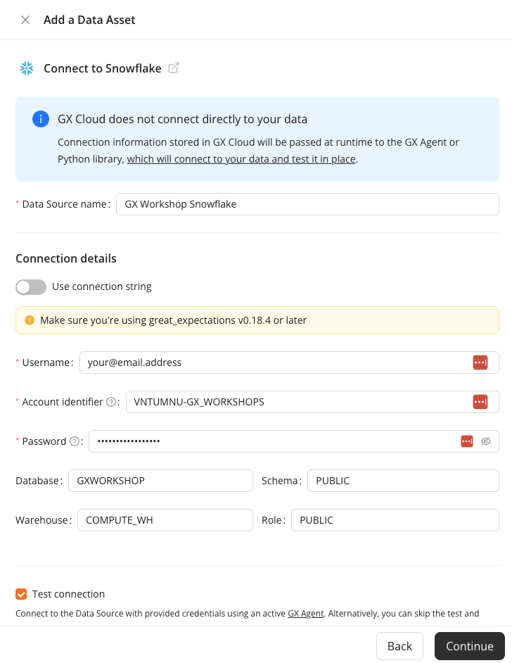<br>

After creating the Data Source and testing its connection, next you'll create the Snowflake Data Asset.

> **Create a Snowflake Data Asset**
> * Select **Table Asset**.
> * In the **Table Name** field, enter `TAXI_DATA`.
> * In the **Data Asset name** field, give your data Asset a name. For example, `Taxi data`.
> * Click the **Finish** button.

Congratulations! You have successfully added a Snowflake Data Asset to your GX Cloud organization.

## Step 4 - Create Expectations
Expectations are a unique GX construct that enable you to make simple, declarative assertions about your data. You can think of Expectations as unit tests for your data. They make implicit assumptions about your data explicit, and they use self-explanatory language for describing data. Expectations can help you better understand your data and help you improve data quality.

In GX Cloud, you create Expectations within an Expectation Suite, which is just a collection of Expectations.

The Snowflake table represented by our Data Asset contains New York City (NYC) taxi data from January 2019. The [NYC Taxi data](https://www.nyc.gov/site/tlc/about/tlc-trip-record-data.page) is a popular set of open source data that contains records of completed taxi cab trips in NYC, including information such as pick up and drop off times, the number of passengers, the fare collected, and more.

As a next step, we'll create Expectations to validate the taxi data. We'll create our new Expectation Suite as a part of creating our first Expectation.

Our first Expectation will expect that there is an associated vendor for each taxi trip. We expect that we should not see any null `vendor_id` values.

> **Create your first Expectation**
> * Locate your Data Asset on the Data Assets screen in GX Cloud.
> * Click on the Data Asset name to bring you to the Data Asset Overview page.
> * Click the New Expectation button.
> * Select **New Suite**.
> * In the Expectation Suite name field, enter a name for the new Expectation suite. For example, `GX Workshop Suite`.
> * Create an initial Expectation to verify that there is an associated vendor for each taxi trip:
>
>   * Select `expect_column_values_to_not_be_null` below **Missingness**.
>   * In the **Column** field, enter `vendor_id`.
>   * Click **Save** to finish creating the Expectation.

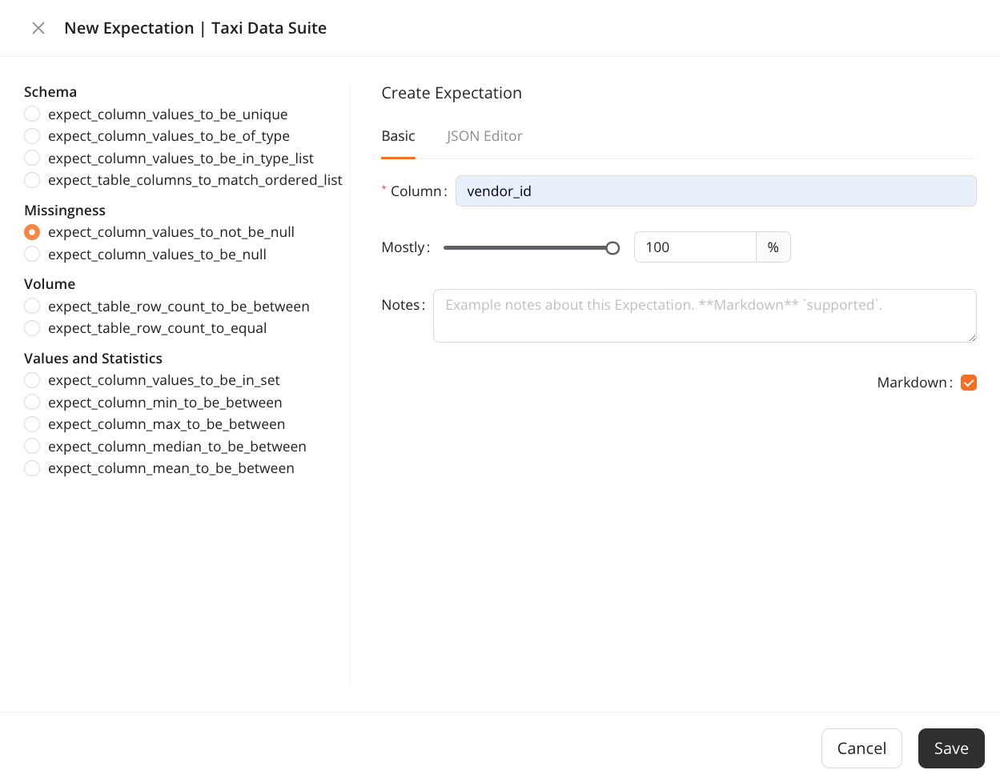<br>

You will now see your first Expectation displayed on the Data Asset Expectations page.

The second Expectation you create will verify the values of the `passenger_count` column. Typically, taxis should have no more than four passengers, since there are normally only four passenger seats in a taxi vehicle.

> **Create your second Expectation**
> * Navigate to the Data Asset Expectations page.
> * Click the **New Expectation** button.
> * Create an Expectation that asserts that there are no more than four passengers for any trip:
>
>   * Select `expect_column_max_to_be_between` below **Values and Statistics**.
>   * In the **Column** field, enter `passenger_count`.
>   * In the **Max Value** field, enter `4`.
>   * Leave the other fields blank.
>   * Click **Save** to finish creating the Expectation.

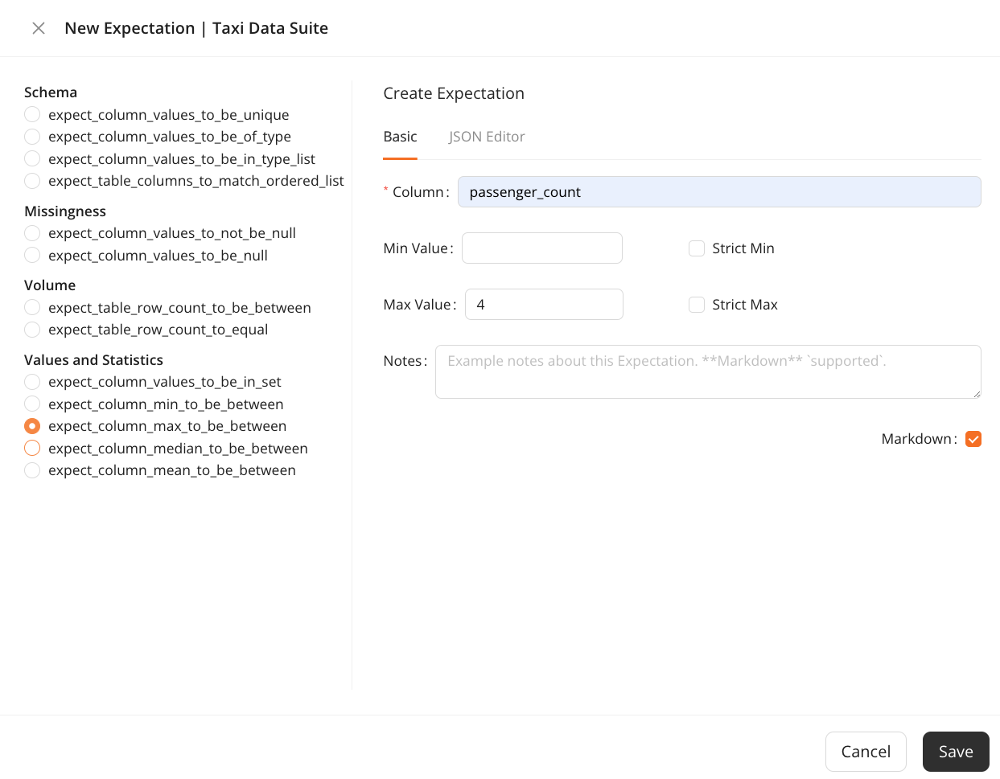<br>


## Step 5 - Validate a Data Asset
You have successfully created two Expectations. Now, let's make sure that they pass as expected when we validate our Data Asset.

> **Validate your Data Asset**
> * Navigate to the Data Asset Expectations page.
> * Click the **Validate** button.

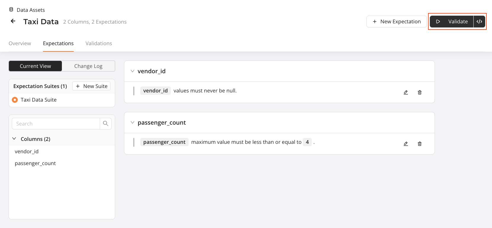<br>

After you click **Validate**, GX Cloud sends a job to your locally running GX Agent to run queries, based on the defined Expectations, against the data in Snowflake. The GX Agent uses the query results to determine if the data fails or meets your Expectations, and reports the results back to GX Cloud.

After validation is completed, you will receive a toast notification in GX Cloud notifying you that the results are ready. To view the results, you can either click on the link provided in the notification, or click on the Data Asset **Validations** tab. Your results will appear similar to this:

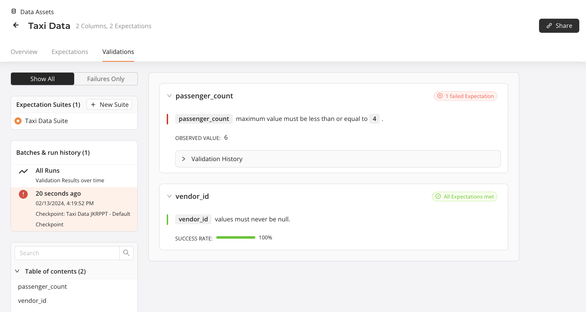<br>

You will see that the `passenger_count` Expectation has failed. This is because some minivan-sized taxis in New York can hold up to six passengers!


## Step 6 - Update failing Expectations and re-run Validations
Let's update the failing `passenger_count` Expectation so that it has the appropriate maximum passenger value.

> **Update your Expectation**
> * Navigate to the Data Asset Expectations page.
> * Click the **Edit** button (represented by pencil icon) on the `passenger_count` Expectation.
> * Update the **Max Value** from `4` to `6`.
> * Click **Save**.

After the Expectation is updated, you can re-run Validation.

> **Validate your Data Asset**
> * Navigate to the Data Asset Expectations page.
> * Click the **Validate** button.

Once validation is completed, navigate to the results and you will see that all your Expectations are now passing, as expected. You can view the history of your Data Asset Validations by clicking **All Runs** under the **Batches & run history** section of the page.

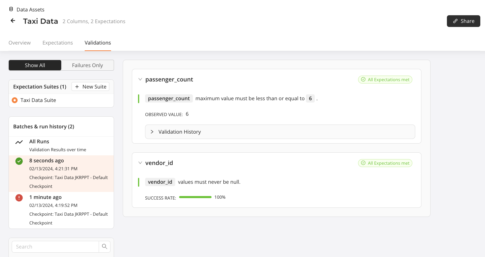<br>

## Step 7 - Fetch Metrics
You might be wondering if there is an easier way to define and create your Expectations, instead of guessing at values or manually inspecting the data. Thankfully, GX Cloud allows you to fetch the metrics from your data directly so that you don't have to!

> **Fetch Metrics for a Data Asset**
> * Navigate to the Data Asset **Overview** page.
> * Click the **Fetch Metrics** button.

When you fetch Metrics for a Data Asset, GX Cloud profiles your Data Asset (via the GX Agent) and returns a collection of descriptive metrics including column types, statistical summaries, and null percentages.

After Metrics have been fetched for your Data Asset, you will be presented with an updated view of your Data Asset on the Overview page. You will see that the Data Asset contains 10,000 rows, as well as some key information about each of the columns. Take some time now to review the data included in Metrics.

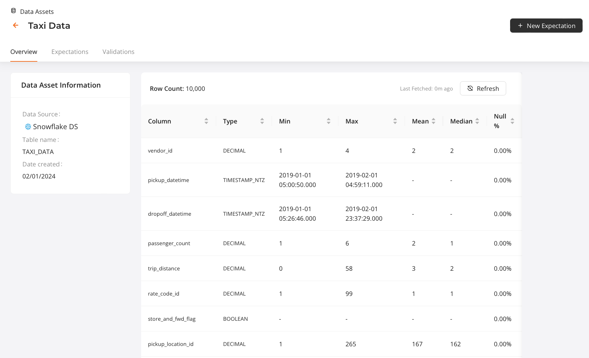<br>

When you have fetched Metrics for a Data Asset, you can use the introspection results when creating new Expectations. Let's create a new Expectation for this Data Asset. Let's note the several subtle, but key, changes on the Expectation creation page.

* You'll notice that when you select new Expectations types, the **Column** input will provide a dropdown menu of existing Data Asset columns, rather than a freeform text field.

* Depending on the Expectation type and column you select, default values will be populated automatically.

> **Examine creating a new Expectation using Metrics data**
> * Navigate to the Data Asset **Overview** page.
> * Click the **New Expectation** button.
> * Select `expect_column_max_to_be_between` under **Values and Statistics**.
> * Select `passenger_count` from the **Column** drop down menu.
> * Note that the **Min Value** and **Max Value** are automatically filled with the column max, `6`.

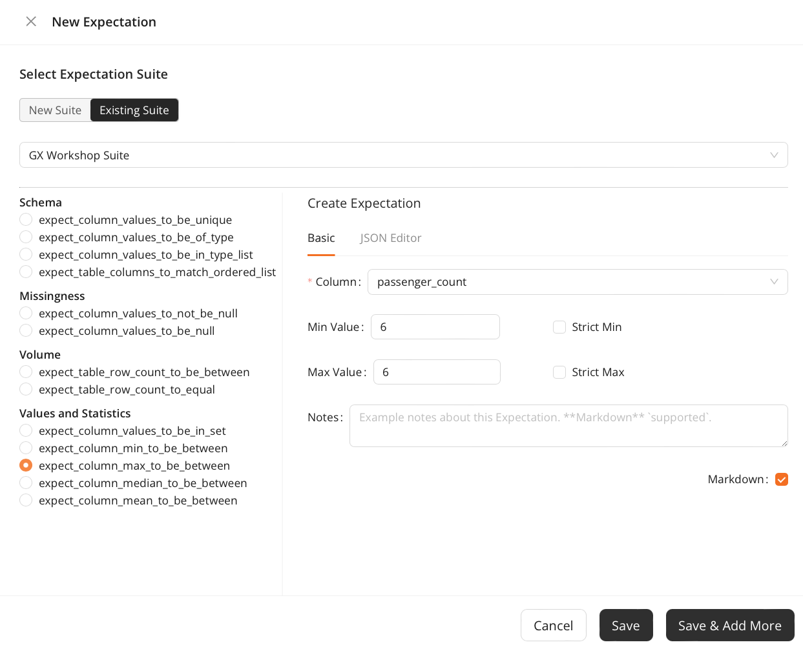<br>


## Conclusion
Congratulations! You've successfully completed the GX Cloud Snowflake Workshop. You have created a Snowflake Data Source and Data Asset, created Expectations, run some Validations, and fetched Metrics for your data. We hope you have a better understanding of how GX Cloud works and how it can work within your data pipeline.

## What's next?
* [Connect to your own Snowflake instance](https://docs.greatexpectations.io/docs/cloud/connect/connect_snowflake)
* [Create your own Expectations in GX Cloud](https://docs.greatexpectations.io/docs/cloud/expectations/manage_expectations)
* Use the [GX Python API](https://docs.greatexpectations.io/docs/oss/) to create Data Sources, Data Assets, Expectations, Expectation Suites, and Checkpoints
* Connect to GX Cloud from an orchestrator (for example, [Airflow](https://airflow.apache.org/))
* [Invite others](https://docs.greatexpectations.io/docs/cloud/users/manage_users#invite-a-user) to work in your GX Cloud organization
* Explore our [documentation](https://docs.greatexpectations.io/docs/cloud/)