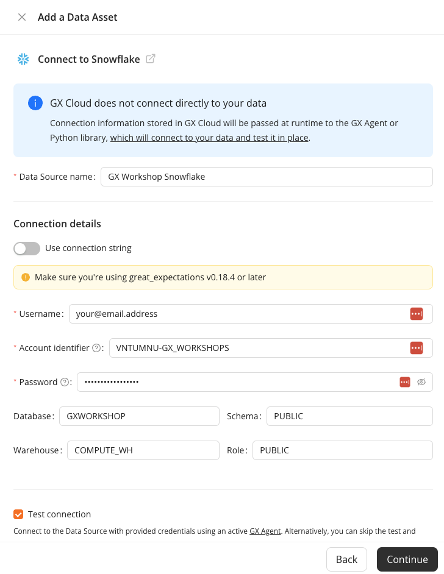
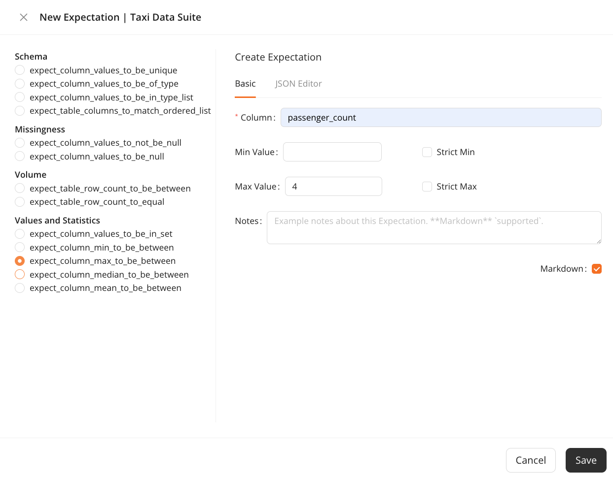

# GX Cloud Snowflake Workshop

Welcome to the GX Cloud Snowflake workshop! In this workshop, you’ll learn how to connect your GX Cloud account to a Snowflake Data Source, create Expectations, and run Validations.

## Prerequisites

- A personal [GX Cloud](https://app.greatexpectations.io/login?ssac=true) account

- [Docker Desktop](https://docs.docker.com/get-docker/) installed and running on the computer you're using for the workshop

- Credentials for the shared [GX Cloud](https://vntumnu-gx_workshops.snowflakecomputing.com/) instance. [Contact us](mailto:support@greatexpectations.io) if you don't have credentials.

## Step 1 - Sign in to GX Cloud and start the GX Agent

1. Sign in to [GX Cloud](https://app.greatexpectations.io/login). 

2. Create a User Access token and copy the organization ID. The GX Agent uses the user access token and organization ID for authentication with your GX Cloud organization: 

    - Click **Settings** > **Tokens**. 

    - In the **Access tokens** pane, click **Create user access token**.

    - In the **Token name** field, enter a name for the token.

    - Click **Create**.

    - Copy the user access token and store it in a safe location.

        

3. Copy the Docker command you'll use to run the GX Agent locally:

    - Click **Agent** and copy the command displayed at the top of the page.

    - Open a terminal and paste the command you copied.

    - Replace `user_access_token` with the value you copied. 

    - Run the command. It may take a few minutes to download the image. When it's done, your terminal displays `The GX Agent is ready.`

## Step 2 - Connect to a Snowflake Data Source and a Data Asset

1. In GX Cloud, click **Data Assets** > **New Asset**.

2. Click **Snowflake**.

3. Configure your Data Source connection:

    - In the **Data Source name** field, enter a name for the Data Source. For example, `GX Workshop Snowflake`.

    - In the **Username** field, enter your Snowflake username.

    - In the **Account identifier** field, enter `VNTUMNU-GX_WORKSHOPS`.

    - In the **Password** field, enter your Snowflake password.

    - In the **Database** field, enter `GXWORKSHOP`.

    - In the **Schema** field, enter `PUBLIC`.

    - In the **Warehouse** field, enter `COMPUTE_WH`.

    - In the **Role** field, enter `PUBLIC`.

    - Select **Test connection** to test the Data Asset connection. When you're done, your screen should appear similar to the following:

        

4. Click **Continue**.

5. Configure your Data Asset:

    - Select **Table Asset**. 
    
    - In the **Table name** field, enter a name for the table you're connecting to. For example, `Taxi Data`.
    
    - In the **Data Asset** name field, enter a name for the Data Asset. For example, `TAXI_DATA`. 
    
6. Click **Finish**.

    Congratulations! You have successfully added a Data Asset to your GX Cloud organization.

## Step 3 - Create an Expectation Suite and add Expectations

You'll be using New York City taxi data from January 2019 for your Expectations. This data has all the trips that were completed by two taxi companies in New York City for January, including information like the vendor, the number of passengers, the fare collected, and so on.

1. In the **Data Assets** list, click the `TAXI_DATA` Data Asset.

2. Click the **Expectations** tab and then **New Suite**. 

3. In the **Expectation Suite** name field, enter a name for the Expectation Suite. For example, `GX Workshop Suite`.

4. Create an Expectation that ensures that there is always an associated vendor with a given trip (or row):

    - Click **New Expectation**.

    - Select `expect_column_values_to_not_be_null` below **Missingness**.

    - In the **Column** field, enter `vendor_id`. Your screen should appear similar to the following:

    

 5. Click **Save & Add More**.

 6. Create an Expectation that checks the passenger count values to determine if the maximum allowable capacity of four passengers is exceeded:

    - Select `expect_column_max_to_be_between` below **Volume**.

    - In the **Column** field, enter `passenger_count`.

    - In the **Min Value** field, enter `1`.

    - In the Max Value field, enter `4`. Your screen should appear similar to the following:

    

7. Click **Save**. Your new Expectations appear in the **Expectations** list.

## Step 4 - Validate the Expectations

You have successfully created two Expectations. Now, it's time to make sure they run as expected. 

1. On the **Expectations** page, click **Validate**. The following image shows the location of the **Validate** button:

    

2. When the notification indicating the Validation was successful appears, click the link in the notification or click the **Validations** tab. Your results appear similar to the following:

    

    Unfortunately, the `passenger_count` Expectation failed because some taxis in New York can hold more than four passengers.

## Step 5 - Correct the failed Expectation and run the Validation again

1. Click the **Expectations** tab.

2. Click **Edit** (the pencil icon) for the `passenger_count` Expectation.

3. In the **Max Value** field, delete `4` and enter `6`.

4. Click **Save**.

5. Click **Validate**. 

6. When the notification indicating the Validation was successful appears, click the link in the notification or click the **Validations** tab. Your results appear similar to the following:

    

    The Expectation is now successful.

## Step 6 - Fetch Metrics

Now, you might be wondering if there is an easier way to create Expectations, instead of guessing at values or manually inspecting the data. Thankfully, GX Cloud allows you to fetch the metrics from your data directly so that you don't have to! 

1. Click the **Overview** tab. Basic information about your Data Asset is displayed in the **Data Asset Information** pane. 

2. Click **Fetch Metrics** to allow GX cloud to analyze your data. When the process completes, an updated view of your Data Asset appears. The Data Asset contains 10,000 rows, as well as some information about each of the columns as shown in the following image:

    

3. Click **New Expectation**. Now that you fetched metrics for the Data Asset, the **Column** field is autopopulated with the Data Asset column names. If you select a `Values and Statistics` Expectation, some values are auto-filled for you when you choose a column. For example, when you select the `expect_column_max_to_be_between` Expectation and the `passenger_count` column, the **Max Value** is automatically `6` as shown in the following image:

    

## Conclusion

Congratulations! You've successfully completed the workshop. You connected to a Snowflake Data Source and created a Data Asset, you created Expectations, you ran Validations, and then you fetched some metrics on the data. We hope you have a better understanding of how GX Cloud works and how it can work within your data pipeline.

## What's next?

- Connect to your own Snowflake instance

- Try creating your own Expectations in GX Cloud

- Use the [GX API](https://docs.greatexpectations.io/docs/reference/api) to create Data Sources, Data Assets, Expectations, Expectation Suites, and Checkpoints

- Connect to GX Cloud from an orchestrator (for example, [Airflow](https://airflow.apache.org/))

- Invite others to work in your GX Cloud organization

- Explore our [documentation](https://docs.greatexpectations.io/docs/cloud/)