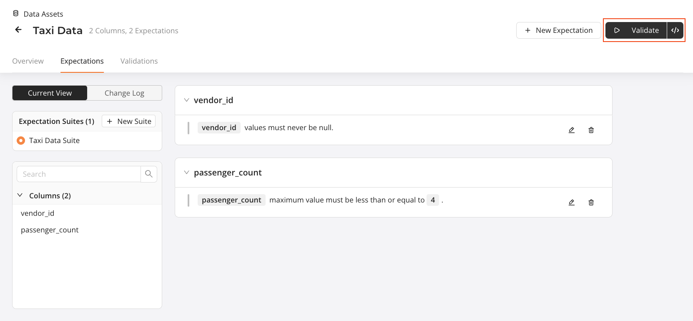
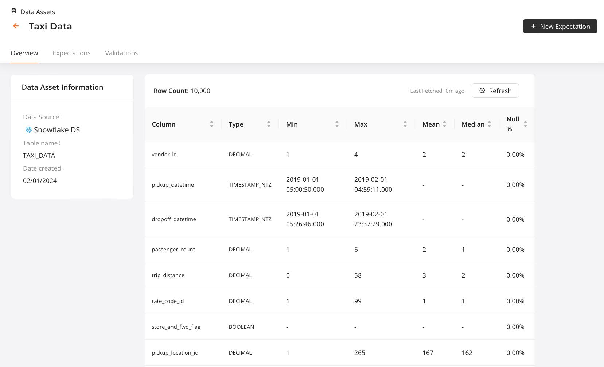

# Getting Started with GX Cloud and Snowflake

This workshop content is current as of 21 February 2024.

## Introduction
Welcome to our *Getting Started with GX Cloud and Snowflake* workshop! In this workshop, you will learn how to connect your GX Cloud account to a Snowflake Data Source, create Expectations, and run Validations.

## Prerequisites
In order to successfully run this workshop, you need to have the following:
- Your own [GX Cloud](https://app.greatexpectations.io/login?ssac=true) account
- [Docker Desktop](https://docs.docker.com/get-docker/) installed and running on your local machine.
- Credentials for our shared [GX Workshop Snowflake instance](https://vntumnu-gx_workshops.snowflakecomputing.com/). Please [reach out to us](mailto:support@greatexpectations.io) if you do not have an account!

## Agenda
This workshop walks you through the following hands-on activities:

1. [Log in to GX Cloud](#step-1---log-in-to-gx-cloud)
2. Run the GX Agent
3. Create a Snowflake Data Source and Data Asset
4. Create Expectations
5. Validate Expectations
6. Fix failing Expectations and re-run Validations

## Basic GX components
If you are new to GX, you'll find the following terminology helpful as you undertake this workshop.

| GX Component | What is it? |
| :- | :- |
| Data Source | The GX representation of a data store. For this workshop, the Data Source is the Snowflake schema containing our data. |
| Data Asset | A collection of records within a Data Source. For this workshop, the Data Asset is the Snowflake table containing our data. |
| Expectation | A verifiable assertion about data. |
| Expectation Suite | A collection of Expectations. |
| Checkpoint | A data validation mechanism that runs an Expectation Suite on a Data Asset. |

## Hands-On Exercises

### Step 1 - Log in to GX Cloud
Start by logging into [GX Cloud](https://app.greatexpectations.io/login).

### Step 2 - Run the GX Agent
GX Cloud does not connect directly to your data. Instead, it uses the **GX Agent** as an intermediary between GX Cloud and your data stores. The GX Agent runs in an environment where it has access to your data - today, you'll run it on your local machine using Docker. The GX Agent receives jobs from GX Cloud, executes these jobs against your data, and then sends the job results back to GX Cloud.

If you are interested in learning more about the GX Agent and how it fits into the GX Cloud architecture, [check out our docs](https://docs.greatexpectations.io/docs/cloud/about_gx#gx-cloud-architecture).

#### Get your user access token and organization id
To allow the GX Agent to connect to your GX Cloud organization, you need to supply a **user access token** and **organization id**.

> **Create a user access token**
> * Click **Settings** > **Tokens** in the sidebar to navigate to the Tokens page.
> * Click the **Create user access token** button.
> * Provide a name for your token and click **Create**.
> * Copy your new token value and store it in a safe place - you'll need it shortly!
>
>   *You are only shown the value of your new token once. If you lose the value, you will need to create a new user access token by repeating the same steps.*

<br>

> **Get your organization id**
> * Click **Settings** > **Tokens** in the sidebar to navigate to the Tokens page.
> * Copy your Organization ID.

<br>

#### Start the GX Agent
Replace the `GX_CLOUD_ACCESS_TOKEN` and `GX_CLOUD_ORGANIZATION_ID` values (shown as `<user_access_token>` and `<organization_id>`, respectively) with your own values in the following Docker command.

```bash
docker run --rm --pull=always -e GX_CLOUD_ACCESS_TOKEN="<user_access_token>" -e GX_CLOUD_ORGANIZATION_ID="<organization_id>" greatexpectations/agent
```

After updating the command with your own user access token and organization id values, execute the command in your local terminal to run the GX Agent using Docker.

Before starting the agent, Docker will download the latest GX Agent image. This may take a few minutes. Once the GX Agent is running, you'll see `The GX Agent is ready.` in your terminal output.


## Step 2 - Create a Snowflake Data Source and Data Asset
Now that the Agent is running, you are ready to connect to Snowflake. Click on the Data Assets page, then on New Data Asset and finally on Snowflake. Give your Data Source a name, e.g. `GX Workshop Snowflake`, and enter in your Snowflake username and password. The account identifier for the Snowflake account is `VNTUMNU-GX_WORKSHOPS`. The database name we'll be using is `GXWORKSHOP` with a Schema of `PUBLIC`, a Warehouse of `COMPUTE_WH` and the role of `PUBLIC`. Be sure to check the *Test connection* checkbox before you click on Continue.

> [!NOTE]
> Your Snowflake username and password is stored securely.


Congratulations! You have successfully added a Data Source to your GX Cloud organization. The last thing you'll do in this step is to add a Data Asset. Give your Data Asset a name, e.g. `Taxi Data`, which points to a table name of `TAXI_DATA`. Click on **Save** to complete the process.

## Step 3 - Create Expectations
An Expectation is a verifiable assertion about your data. They make implicit assumptions about your data explicit, and they provide a flexible, declarative language for describing expected behavior. They can help you better understand your data and help you improve data quality. An Expectation Suite contains multiple Expectations.

Now that you have created a Data Asset, click into the record. On the following page, click on the New Expectation button at the top righthand corner of the screen. You will be creating a new Expectation Suite, so start by giving it a name, e.g. `GX Workshop Suite`.

The data set that you will be using is New York City taxi data from January 2019. This data has all of the trips that were completed by two taxi companies in New York City for that month, including information such the vendor, the number of passengers, the fare collected and more. The first expectation you will create ensures that there is always an associated vendor with a given trip (or row). Start by selecting `expect_column_values_to_not_be_null` under Missingness. On the righthand side, enter `vendor_id` into the Column field. Click **Save** to finish creating this Expectation.


The second Expectation you will be adding is to check the values of the `passenger_count` column. Typically, taxis should have no more than 4 passengers since there are only 4 seats. Click on **New Expectation** at the top right of the screen. Select `expect_column_max_to_be_between` and then enter in `passenger_count` into the Column field. Enter `4` into the Max Value while leaving the other fields blank. Click on **Save**, which will close this panel. You will now see the two Expectations listed.


## Step 4 - Validate the Expectations
You have successfully created some Expectations on our data, so let's make sure they are running as expected. From the same screen click on the **Validate** button in the top righthand corner. After a few moments, you will receive a toast notification to tell you that the results are ready. You can either click on the link on the toast notification itself, or click on the **Validations** tab.



You will see that while the Validation has run, the `passenger_count` Expectation has failed. This is because some taxis in New York can hold up to 6 people! 


## Step 5 - Fix the Failing Expectation and Re-run the Validation
Let's fix the Expectation so that it has the right values. Click back to the **Expectations** page within the Data Asset. On the `passenger_count` Expectation, click on the pencil icon to edit the Expectation. Update the Max Value from `4` to `6` and then click on **Save**.

You can now re-run the Validation by clicking on **Validate** once again on the top righthand corner of the screen. Once the Validation has run (look for the notification!), click back to the **Validations** screen to view the new results. You will see that the Expectations are now passing as expected.


> [!NOTE]
> You can view the full history of your Validation Runs by clicking on **All Runs** on the lefthand side.

## Step 6 - Fetch Metrics
You might be wondering if there is a better and easier way to set up your Expectations, instead of guessing at values or manually inspecting the data. Thankfully, GX Cloud allows you to fetch the metrics from your data directly so that you don't have to! Head back to the **Overview** page of your Data Asset. You will see some basic information about your asset on the lefthand side. On the main panel, you will see a button labeled, **Fetch Metrics**. Click on that button and allow the system to analyze your data. 

Once the Metrics have completed, you will be presented with an updated view of your data. You will see that the Data Asset contains 10,000 rows, as well as some key information about each of the columns. Feel free to take some time now to review some of the data shown here.



When you are ready, click on **New Expectation** in the top righthand corner one last time. Now that you have fetched the metrics on the data, there are a few subtle, but key changes that you will notice on this page. First, whenever you select an Expectation on the lefthand side, the Column field has changed from a free text field into a dropdown where you can select the specific column you'd like to test. Furthermore, if you select a `Values and Statistics` Expectation, choosing a column will auto-fill some of the values for you.

For example, click on the `expect_column_max_to_be_between` Expectation and select `passenger_count` in the Column dropdown. You will see that since the metrics have been generated for this data set, the Values have been automatically filled in with `6`.


## Conclusion
Congratulations! You've successfully completed the GX Cloud Snowflake Workshop. By now, you will have created a Snowflake Data Source and Data Asset, created Expectations, run some Validations and fetched some metrics on the data. We hope you have a better understanding of how GX Cloud works and how it can work within your data pipeline.

## What's next?
- Connect to your own Snowflake instance
- Create your own Expectations in GX Cloud
- Use the [GX API](https://docs.greatexpectations.io/docs/reference/api) to create Data Sources, Data Assets, Expectations, Expectation Suites, and Checkpoints
- Connect to GX Cloud from an orchestrator (e.g. [Airflow](https://airflow.apache.org/))
- [Invite others](https://docs.greatexpectations.io/docs/cloud/users/manage_users#invite-a-user) to work in your GX Cloud organization
- Explore our [documentation](https://docs.greatexpectations.io/docs/cloud/)